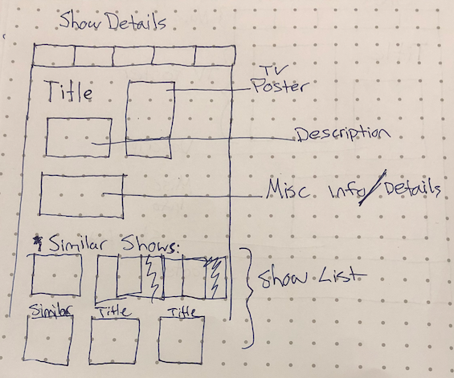

# project_2
# **Worth Watching?**

## Project Planning


### Overview

_**Worth Watching** is a site that will enable users to not only lookup details about their favorite shows, but find new things to watch through suggestions based on what they like and search for trending titles that are currently airing._

<br>

### Wireframes


Homepage


<br>

Navigation Bar


<br>

Show Details


<br>

Show List


<br>

Mobile View


<br>
***

<br>

### MVP

_The **Worth Watching** MVP will consist of a television search by title name which will show a list of results.  These results will be click-through-able to their own page with more information about that particular show. This detail page will house suggestions for similar shows which will also link to their own detail page.  The detail page should consist of the shows poster image, title, description, misc info and similar shows._

#### Goals

- _More category pages:_
- _Discovery - Ability to adjust search terms to search for shows that interest you!_
- _Currently airing - Adjustable to show top shows airing today/tonight with sorting options!_
- _Trending/Popular this week - Will show top trending shows this week & Top rated/Currently Popular shows as a showList._
- _Perhaps a search for show creators/people_
- _Top Rated shows by genre? - Adjustable query term? Dropdown?_
- _Bookmarking feature as you search through shows, you can ear-mark them to see everything you've put aside for yourself_
- _Different View options for the ShowList (results after search), Grid view or list view* - Button that allows user to choose which view they prefer?_
- _Different Sorting Options for currently airing and showList_

<br>
#### Libraries


|     Library      |                       Description                       |
| :--------------: | :------------------------------------------------------: |
|   React Router   | _Routing for my Nav component to link to other sections_ |

#### API Data

|    API       | Quality Docs? |            Website            |                                 Sample Query                                    |
| :----------: | :-----------: | :---------------------------: | :-----------------------------------------------------------------------------: |
| movie DB API |      yes      | _https://www.themoviedb.org/_ | _https://api.themoviedb.org/3/tv/top_rated?api_key=${KEY}language=en-US&page=1_ |

<br>
#### React Components

_Component Hierarchy_

```
src
|__ services/
      |__ api-helper.js
|__ components/
      |__ Header.jsx
      |__ Nav.jsx
      |__ Show.jsx
      |__ ShowList.jsx
      |__ ShowDetails.jsx
      |__ ShowInfo.jsx
      |__ Button.jsx
      |__ Bookmarks.jsx
      |__ ShowPoster.jsx
      |__ Footer.jsx
```

_Component Breakdown_


|  Component   |    Type    | state | props | Description                                                      |
| :----------: | :--------: | :---: | :---: | :--------------------------------------------------------------- |
|    Header    | functional |   n   |   n   | _The header will contain the navigation and logo._               |
|  Nav         | functional |   n   |   n   | _The navigation will provide a link to each of the pages._       |
|   ShowList   |   class    |   y   |   n   | _The showlist will house the api response data and render and map through it_      |
| Show         | functional |   n   |   y   | _Just shows the show title and image_                 |
| ShowDetails  | functional |   n   |   y   | _Will render the entire details for a show Title, image, desription and more info_ |
| ShowInfo     | functional |   n   |   y   | _Just renders the shows Misc Information_                 |
| Button       | functional |   n   |   y   | _Render a single button and accept a handleSubmit_                 |
| Bookmarks    | functional |   y   |   y   | _House bookmarked list of show id's in an array and can create a ShowList of them_                 |
|    Footer    | functional |   n   |   n   | _The footer will show info about me and a link to my portfolio._ |

_Component Estimates_

| Task                | Priority | Estimated Time | Time Invested | Actual Time |
| ------------------- | :------: | :------------: | :-----------: | :---------: |
| Create landing page with title search   |    H    |     4 hrs      |     TBD    |    TBD   |
| create ShowList cpnt                    |    H     |     6 hrs      |     TBD    |     TBD     |
| create ShowDetails cpnt                 |    H     |     6 hrs      |     TBD    |     TBD     |
| create ShowList cpnt                    |    H     |     6 hrs      |     TBD    |     TBD     |
| Nav Routing                             |    H     |     6 hrs      |     TBD    |     TBD     |
| TOTAL                |          |     10 hrs     |     TBD     |     TBD     |


<br>

***

<br>

### Post-MVP

> Use this section to document ideas you've had that would be fun (or necessary) for your Post-MVP. This will be helpful when you return to your project after graduation!

#### Post-MVP Goals

- _Add user account and auth capabilities._

#### Post-MVP Data

- _Utilize the Giphy API to welcome new users with funny gifs._

<br>

***

<br>

## Project Delivery

> The Delivery section should be expanded and revised as you work on your project.

### Helper Functions

> Use this section to document all helper functions– generic functions that can be reused in other applications.

|  Function  | Description                                |
| :--------: | :----------------------------------------- |
| Capitalize | _Lorem ipsum dolor sit amet, consectetur._ |


### Code Showcase

> Use this section to include a brief code snippet of functionality that you are proud of an a brief description  

```
function reverse(string) {
	// here is the code to reverse a string of text
}
```

### Code Issues & Resolutions

> Use this section to list of all major issues encountered and their resolution.

| Error                                                   | Resolution                                             |
| :------------------------------------------------------ | :----------------------------------------------------- |
| `app.js:34 Uncaught SyntaxError: Unexpected identifier` | Missing comma after first object in sources {} object. |